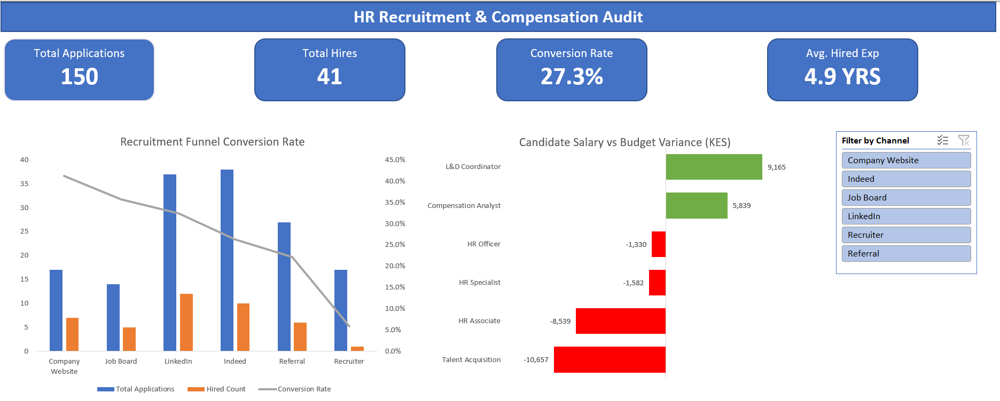
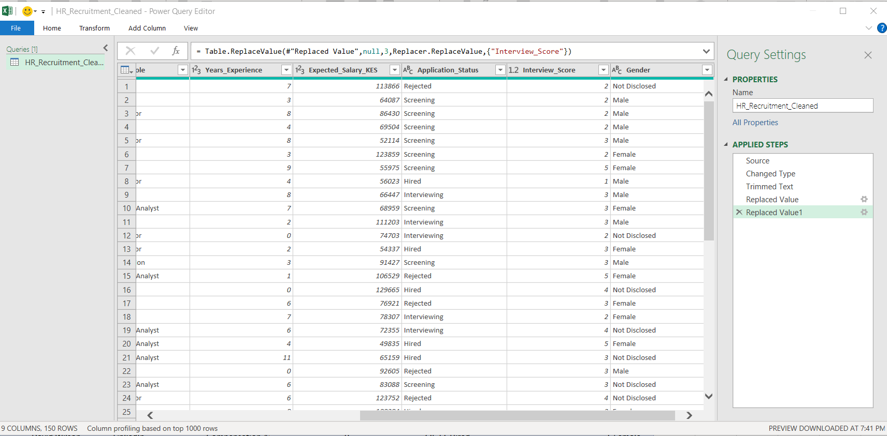
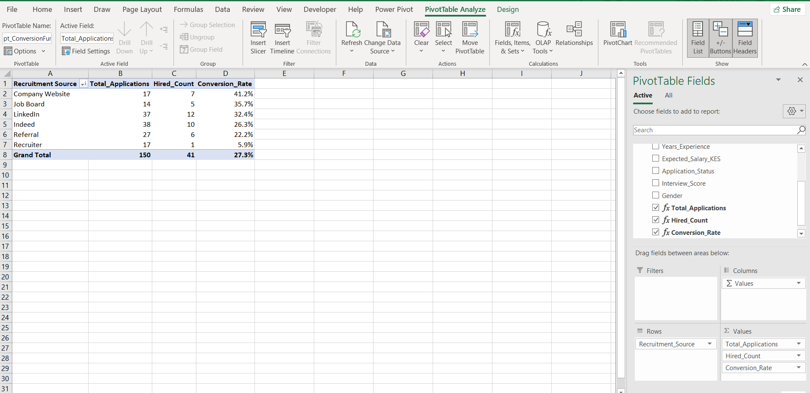

# HR Recruitment & Compensation Audit 📊

**Author:** Joseph Omusitia | IHRM Associate Member (Reg. 22716)

## 📌 Project Overview
This project is an end-to-end Human Resources Data Analytics audit designed to bridge the gap between raw recruitment data and executive hiring strategy. The objective was to evaluate sourcing channel efficiency, analyze candidate salary expectations against internal financial budgets, and establish historical data benchmarks for successful hires.

The final deliverable is a dynamic, interactive Excel dashboard built for HR Directors and executive decision-makers.

## 🎯 Core Business Questions Answered
1. **Channel Efficiency:** Which sourcing channels deliver the highest conversion rates from application to hire?
2. **Financial Exposure:** Where are candidate salary demands exceeding approved internal compensation bands?
3. **Candidate Profiling:** What are the baseline experience and interview score requirements to secure a role?

## 🖼️ Executive Dashboard
*(The interactive dashboard allows users to filter all metrics and charts in real-time by Recruitment Source).*

## ⚙️ Behind the Scenes: Data Architecture
To build the interactive dashboard, the raw HR logs required significant transformation and modeling.

### 1. Data Transformation (Power Query)
Automated the ETL (Extract, Transform, Load) process to clean raw text strings, handle null values, and standardize currency formatting before loading it into the data model.

### 2. Relational Modeling & DAX
Built a star-schema data model linking the recruitment fact tables with internal compensation dimension tables. Engineered custom DAX measures (using `CALCULATE`, `ALL`, and `AVERAGE`) to enable the dynamic slicer filtering on the dashboard.

## 📈 Key Executive Insights
* **Sourcing ROI:** While platforms like LinkedIn generated massive top-of-funnel volume, the highest actual conversion rate to 'Hired' came directly from the Company Website.
* **Budget Variance Alert:** The `Talent Acquisition` and `HR Associate` roles face the most severe market misalignment, with applicants consistently demanding salaries well above the current internal budget caps.
* **Talent Benchmarks:** Historical data proves the baseline for a successful hire requires an average of 4.9 years of experience and a strict interview score of 3.1/5.0.

## 📂 How to Use This Repository
1. Download the [HR_Audit_Project.xlsx](HR_Audit_Project.xlsx) file.
2. Open in Microsoft Excel (ensure macros/content are enabled if prompted).
3. Use the **Filter by Channel** slicer on the right side of the Dashboard tab to interact with the data model.

